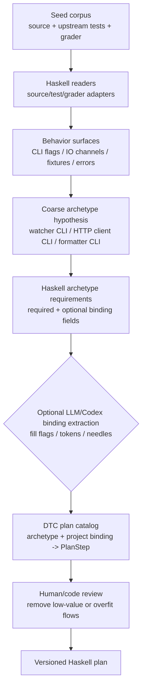
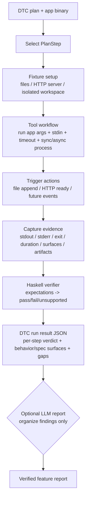

# hs-blackbox-agent - Haskell DTC flows

DTC 要分成两条流程看：

- **构建流程**：把公开源码和测试流程沉淀成可复用的 Haskell DTC plan。
- **Agent 执行流程**：拿一个 DTC plan 和一个目标 binary，执行 fixture/run/trigger/verify。

当前实现只有 Haskell DTC runtime。图里的 optional LLM 节点是未来边缘能力占位，不是现有代码路径。

`hsbb` 本体是工具类工作流：负责执行 plan、隔离 workspace、触发事件、采集 stdout/stderr/exit/duration、做 Haskell verifier。`WatcherCli` / `HttpClientCli` 这类 archetype 是业务工作流库，entr/bat 是项目绑定。不要把三层混成一个大流程。

## 构建流程

构建流程的产物是 plan，不执行目标程序，也不判断某个 app 是否通过。

## Agent 执行流程

执行流程不读取 grader 私有答案，不让 LLM 打分，也不通过 oracle/confidence 收敛。

## 当前实现状态

已完成：

- `hsbb dtc plan entr`
- `hsbb dtc plan bat`
- `hsbb dtc flow`
- `hsbb dtc requirements WatcherCli`
- `hsbb dtc run <entr|bat> --app=<binary> [--out=<dir>]`

Runtime 当前支持每步隔离 `${WORK}`、可选 result JSONL 落盘、文件类 fixture、同步/异步 `RunSpec`、stdin、timeout 安全外壳、file append trigger、evidence-stop、基础 stdout/stderr/exit/duration expectation。`PlanStep` 和 `DtcRunResult` 已带 behavior/spec surface tags。`StartHttpFixture` 仍会显式返回 unsupported gap。

执行结果会返回 JSON；使用 `--out=<dir>` 时还会在 run 目录写 `results.jsonl`，每行对应一个 step，并包含 `drrWorkDir`。

## 已删除旧逻辑

旧 DeepSeek/oracle/confidence loop 已从编译面删除，不再有 legacy CLI。
