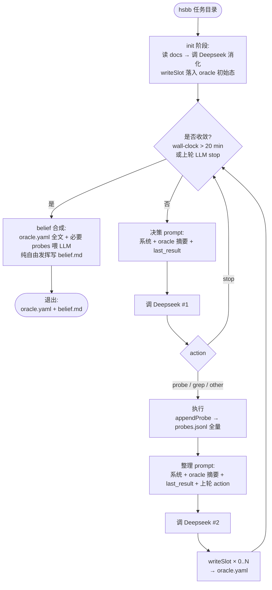

# hs-blackbox-agent — 流程图（v2）

## 关键设计点

- **4 个 LLM 调用阶段**：init 消化 / 每轮决策 / 每轮整理 / 收敛后 belief 合成
- **决策 / 整理拆开**：决策 prompt 出 action（只此一项），整理 prompt 出 writeSlot（可零可多）。两件事不互挤
- **docs 不进主循环 prompt**：init 一次消化进 oracle，主循环只走 oracle 摘要
- **唯一闸门 Conv**：harness 20 min wall-clock + LLM stop 两个触发器统一从 Conv 出去
- **belief.md 不进 ReAct loop**：收敛后单次合成，纯 LLM 发挥（不结构化提示）
- **last_result 极短命**：只跨"探索 → 整理 prompt"那一步，被整理后即弃；后续要全量走 `lookupProbe`
- **错误容错**：Deepseek 调用 3 次重试，仍败意外退出

## 持久层（详见 SHAPES.md）

| 文件 | 内容 |
|---|---|
| `oracle.yaml` | 7 universal 槽 + other 自由槽 |
| `probes.jsonl` | 每个 probe 一行，含全量 stdout/stderr |
