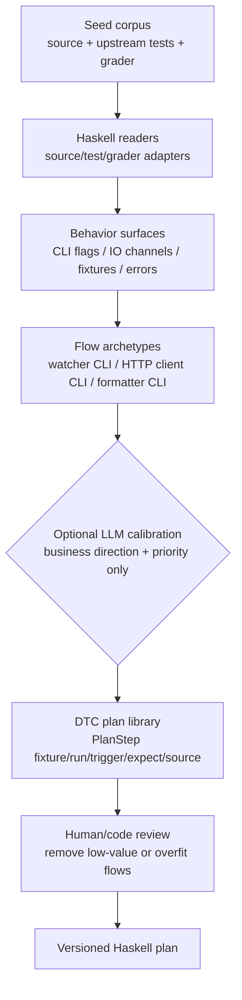
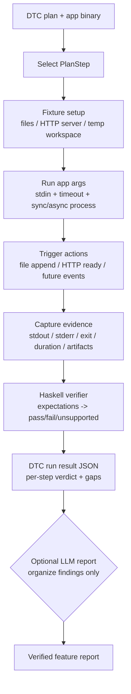

# hs-blackbox-agent - Haskell DTC flows

DTC 要分成两条流程看：

- **构建流程**：把公开源码和测试流程沉淀成可复用的 Haskell DTC plan。
- **Agent 执行流程**：拿一个 DTC plan 和一个目标 binary，执行 fixture/run/trigger/verify。

## 构建流程

构建流程的产物是 plan，不执行目标程序，也不判断某个 app 是否通过。

## Agent 执行流程

执行流程不读取 grader 私有答案，不让 LLM 打分，也不通过 oracle/confidence 收敛。

## 当前实现状态

已完成：

- `hsbb dtc plan entr`
- `hsbb dtc plan bat`
- `hsbb dtc flow`
- `hsbb dtc run <entr|bat> --app=<binary>`

Runtime 当前支持文件类 fixture、同步/异步 `RunSpec`、stdin、timeout、file append trigger、基础 stdout/stderr/exit/duration expectation。`StartHttpFixture` 仍会显式返回 unsupported gap。

## 已删除旧逻辑

旧 DeepSeek/oracle/confidence loop 已从编译面删除，不再有 legacy CLI。
