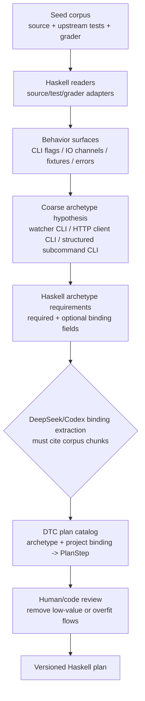
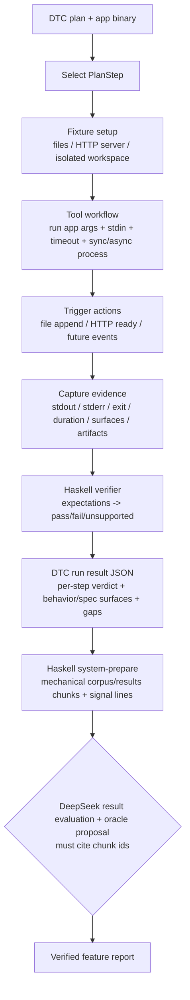

# hs-blackbox-agent - Haskell DTC flows

DTC 要分成两条流程看：

- **构建流程**：把公开源码和测试流程沉淀成可复用的 Haskell DTC plan。
- **Agent 执行流程**：拿一个 DTC plan 和一个目标 binary，执行 fixture/run/trigger/verify。

当前实现以 Haskell DTC runtime 为执行核心。DeepSeek 不在 hot path 中逐步 probe，而是通过 `dtc system-prepare` 生成的机械读取包做系统层决策、执行结果评估和 oracle/report 提案。

`hsbb` 本体是工具类工作流：负责执行 plan、隔离 workspace、触发事件、采集 stdout/stderr/exit/duration、做 Haskell verifier。`WatcherCli` / `HttpClientCli` / `StructuredSubcommandCli` 这类 archetype 是业务工作流库，entr/bat/atlas 是项目绑定。不要把三层混成一个大流程。

## 构建流程

构建流程的产物是 plan，不执行目标程序，也不判断某个 app 是否通过。

## Agent 执行流程

执行流程不读取 grader 私有答案，不让 LLM 打分，也不通过 oracle/confidence 收敛。

## 当前实现状态

已完成：

- `hsbb dtc plan entr`
- `hsbb dtc plan bat`
- `hsbb dtc flow`
- `hsbb dtc requirements WatcherCli`
- `hsbb dtc requirements HttpClientCli`
- `hsbb dtc requirements StructuredSubcommandCli`
- `hsbb dtc plan-binding --binding=<file>`
- `hsbb dtc run-binding --binding=<file> --app=<binary> [--out=<dir>]`
- `hsbb dtc system-prepare --corpus=<dir> [--results=<results.jsonl>] [--out=<file>]`
- `hsbb dtc system-call --packet=<file> --stage=<stage> [--out=<file>]`
- `hsbb dtc system-validate --packet=<file> --stage=<stage> --response=<file>`
- `hsbb dtc run <entr|bat> --app=<binary> [--out=<dir>]` for regression seeds only

Runtime 当前支持每步隔离 `${WORK}`、可选 result JSONL 落盘、文件类 fixture、轻量本地 HTTP fixture、同步/异步 `RunSpec`、stdin、timeout 安全外壳、file append trigger、evidence-stop、基础 stdout/stderr/exit/duration expectation。`PlanStep` 和 `DtcRunResult` 已带 behavior/spec surface tags。HTTP fixture 目前支持 method/path/query/header/body needle 匹配，后续还要补 request artifact index。

PB reference task 的标准执行拓扑是：`hsbb` 与 `/workspace/executable` 位于同一个
task container。host `hsbb` 通过 `docker exec` wrapper 调用黑盒会造成 `${WORK}`
文件不可见、`127.0.0.1` fixture 不可达等失真；这不是业务流程结果。详见
`docs/pb/README.md`。

`system-prepare` 当前负责 LLM 前置机械化：递归读取 corpus 文本文件、切 chunk、提取 signal lines、读取可选 `results.jsonl`，并生成 DeepSeek 的 `archetype_decision` / `binding_generation` / `result_evaluation` / `oracle_generation` 四阶段 prompt。LLM 输出必须引用 chunk id 或 result chunk id；证据缺失时应返回 `missing_or_ambiguous`。

`system-call` 是唯一真实 DeepSeek API 出口，使用 `DEEPSEEK_API_KEY` 和 OpenAI-compatible chat completions；`system-validate` 是离线输出校验器，会检查阶段必填字段和 chunk/result citation。真实 API 调用会外发 system packet，默认需要人工确认数据边界。

执行结果会返回 JSON；使用 `--out=<dir>` 时还会在 run 目录写 `results.jsonl`，每行对应一个 step，并包含 `drrWorkDir`。

## 已删除旧逻辑

旧 DeepSeek/oracle/confidence loop 已从编译面删除，不再有 legacy CLI。
