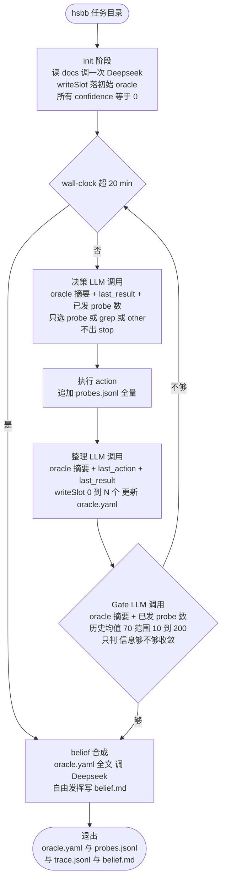

# hs-blackbox-agent — 流程图（v3）

## 关键变化（v2 → v3）

- **决策与收敛判断拆开两个 LLM 节点**：决策只想「探什么」，Gate 只想「够不够」，互不干扰
- **决策不再出 stop**：能到决策这一步必定继续探，action 集合塌成 probe / grep / other 三选
- **Gate 节点专吃 stat 信号**：probe 计数 + 历史均值是 Gate 的核心输入，决策不再被这类元数据干扰
- 收敛触发器仍 2 个：harness 端 wall-clock 20 min / LLM 端 Gate 判「够」

## 关键设计点

- **5 个 LLM 调用阶段**：init / 每轮决策 / 每轮整理 / 每轮 Gate / 收敛后 belief
- **每轮 3 次 LLM 调用**（决策 + 整理 + Gate）—— 比 v2 多一次
- **docs 不进主循环 prompt**：init 一次消化进 oracle，主循环只走 oracle 摘要
- **init 写入 confidence 一律 0**：文档推断不可置信，逼 probe 实测后再升级
- **oracle 摘要里空槽显式 `[EMPTY]`**，避免「看不到 = 已覆盖」误判
- **belief.md 不进 ReAct loop**：收敛后单次合成，纯 LLM 发挥
- **last_result 极短命**：跨「探索 → 整理 prompt」一步，被整理后即弃；后续要全量走 `probes.jsonl` 直接查
- **错误容错**：Deepseek 调用 3 次重试，仍败意外退出

## 持久层（详见 SHAPES.md）

| 文件 | 内容 |
|---|---|
| `<task>/.hsbb/oracle.yaml` | 7 universal 槽 + other 自由槽 |
| `<task>/.hsbb/probes.jsonl` | 每个 probe 一行，含全量 stdout/stderr |
| `<task>/.hsbb/trace.jsonl` | append-only 事件流（phase_start / llm_request / llm_response / tool_dispatch / phase_end / convergence） |
| `<task>/.hsbb/belief.md` | 收敛后合成 |

所有产物都在 `.hsbb/` 隐藏目录里，不污染任务原始环境。
